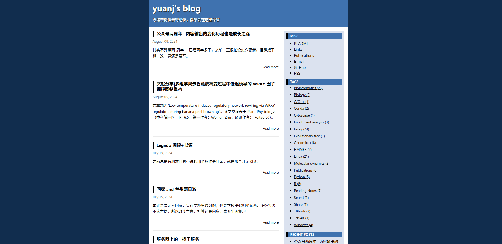

## README

Inspired by [Yunfeng's blog](https://blog.codingnow.com/), this is a secondarily modified Hugo theme based on [Mainroad](https://github.com/Vimux/Mainroad). The style is simple, classical, and nostalgic, focusing the blog's emphasis on content, paying tribute to the era.

DEMO: [https://yuanj.top](https://yuanj.top)



## Configuration

The `config.toml` should be configured as follows:

```toml
baseurl = "https://yuanj.top"
title = "yuanj's blog"
languageCode = "en-us"
paginate = "10"                          # Number of articles per page
theme = ["cloud"]

[Params]
  post_meta = ["date"]
  mainSections = ["posts"]                           # Set the post directory
  mathjax = true

[Params.topbar]
  subtitle = "Thoughts come and go quickly, occasionally stopping here"     # Top bar subtitle

[Params.sidebar]
  home = "right"                                         # Sidebar position
  widgets = ["misc", "taglist", "recent"]     # Items to display in the sidebar

[Params.widgets]
  recent_num = 11                 # Set the number of articles for the RECENT POSTS section
  tags_counter = true             # Whether to display the number of articles for each tag
  [[Params.widgets.misc.custom]]  # MISC section can define multiple pages or URLs; pages should be created in the content directory
    title = "README"
    url = "/readme"
  [[Params.widgets.misc.custom]]
    title = "Links"
    url = "/links"
  [[Params.widgets.misc.custom]]
    title = "Publications"
    url = "/publications"
  [[Params.widgets.misc.custom]]
    title = "E-mail"
    url = "/images/email.png"
  [[Params.widgets.misc.custom]]
    title = "GitHub"
    url = "https://github.com/yuanj82"
  [[Params.widgets.misc.custom]]
    title = "RSS"
    url = "/index.xml"
```

The comment system code is in `layouts/partials/comments.html`, with giscus as the default. To use another comment system, simply paste the corresponding code into `comments.html`.
